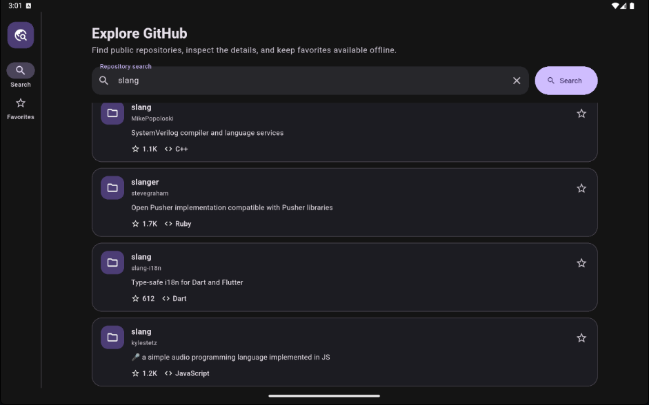
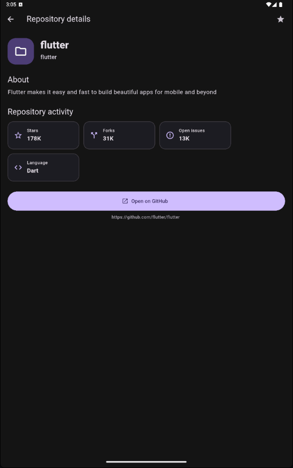
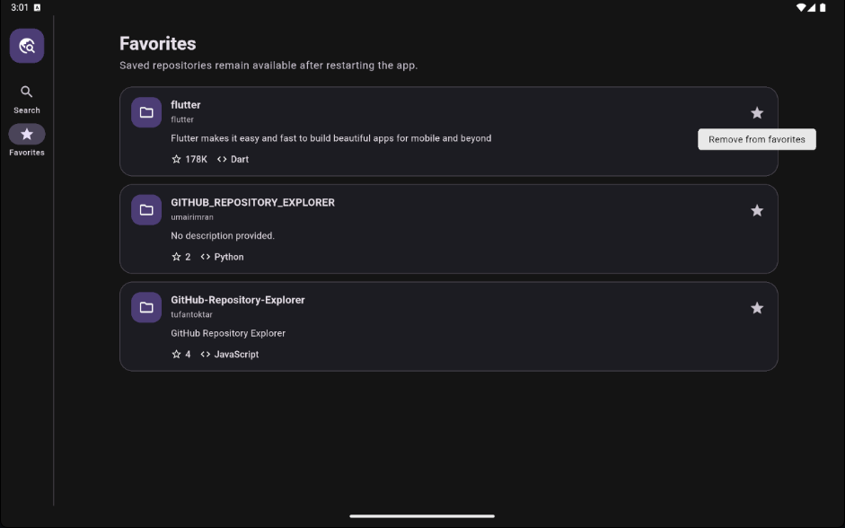
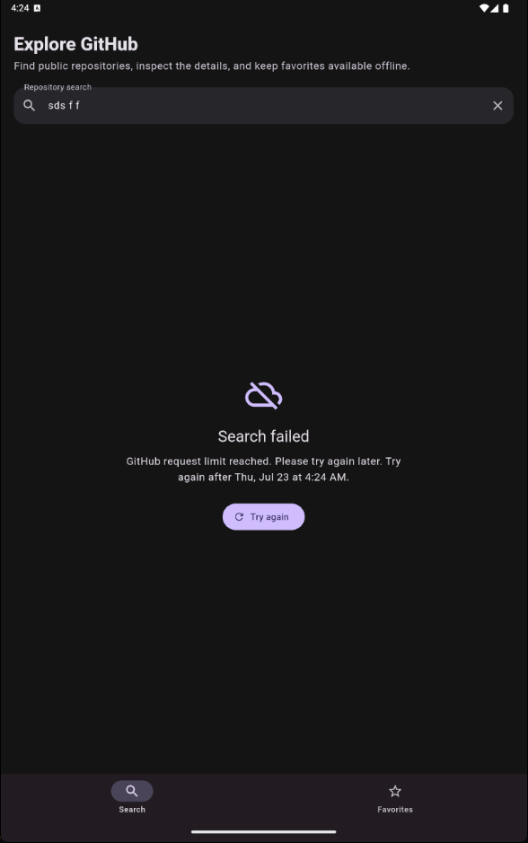
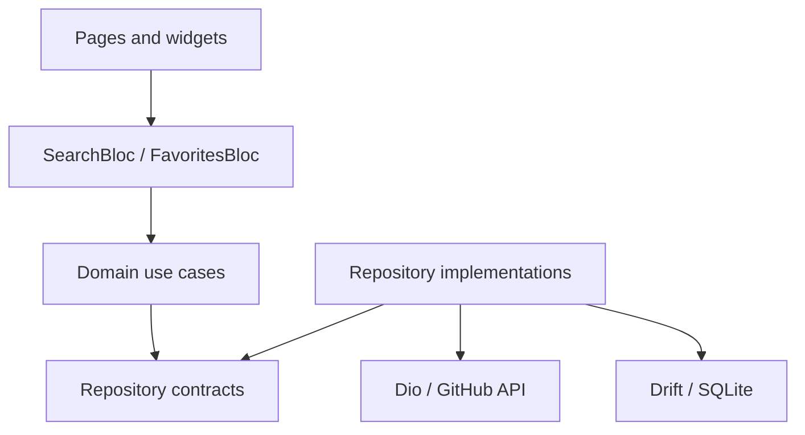

# Repo Scout

Repo Scout is a Flutter application for searching public GitHub repositories,
reviewing repository details, and keeping a persistent collection of favorites.
It is intentionally structured as a production-minded reference project: full
feature-first Clean Architecture, SOLID boundaries, explicit BLoC state,
offline-first reads, adaptive tablet UI, and automated tests.

## Product capabilities

- Search public repositories through the GitHub REST API.
- Debounced search with an explicit submit action and stale-request protection.
- Loading, empty, error, cached, stale, pagination, and refresh UI states.
- Repository details with stars, forks, open issues, language, and GitHub link.
- Persistent favorites available without a network connection.
- Stale-while-revalidate search cache backed by Drift/SQLite.
- Infinite pagination with inline failure recovery.
- System light and dark themes.
- Adaptive phone and tablet navigation and content widths.
- Semantic labels, tooltips, live regions, and accessible touch targets.
- Native Android and iOS icons and splash screens.

The app deliberately uses the unauthenticated public API. No GitHub token is
embedded in the application or expected in source control.

## App preview

The gallery focuses on the primary journey instead of repeating every
intermediate state: search, repository detail, persistent favorites, and the
adaptive tablet layout.

<p align="center">
  
</p>
<p align="center">
  <strong>Search results</strong> — adaptive tablet navigation and readable
  content width.
</p>

<p align="center">
  
</p>
<p align="center">
  <strong>Repository detail</strong> — activity, language, favorite, and GitHub
  link.
</p>

<p align="center">
  
</p>
<p align="center">
  <strong>Favorites</strong> — persisted repositories remain available offline,
  while the tooltip explains the removal action.
</p>

<details>
  <summary>Additional recovery state</summary>
  <p align="center">
    
  </p>
  <p align="center">
    A rate-limit failure explains when requests can resume and keeps retry
    available.
  </p>
</details>

## Screens and responsive behavior

Phones use a bottom `NavigationBar`. At the tablet breakpoint (840 logical
pixels), the shell switches to a persistent `NavigationRail`, the search action
moves beside the text field, and content is constrained to a readable maximum
width. The layout continues to scale on larger tablets without stretching cards
across the entire display.

## Architecture



Dependencies point inward. The domain layer has no dependency on Flutter, Dio,
Drift, or `get_it`. Data implements domain contracts; presentation depends on
use cases. `get_it` is restricted to the composition root and route-level BLoC
creation. Every other class receives dependencies through its constructor.

```text
lib/
├── app/                         # Bootstrap, DI, routing, shell, theme
├── core/                        # Failures, Result, networking, cache policy
└── features/repository_explorer/
    ├── domain/                  # Entities, contracts, use cases
    ├── data/                    # DTOs, mappers, sources, Drift, implementations
    └── presentation/            # BLoCs, pages, adaptive widgets
```

See [docs/ARCHITECTURE.md](docs/ARCHITECTURE.md) for state, cache, schema, and
SOLID decisions. Agent contributors must also follow [AGENTS.md](AGENTS.md) and
[docs/AGENT_WORKFLOW.md](docs/AGENT_WORKFLOW.md).

## Offline and cache behavior

Search uses stale-while-revalidate:

1. A cached page is emitted immediately when available.
2. The same request is sent to GitHub in the background.
3. A successful response replaces the cached page in one Drift transaction.
4. If refresh fails, cached content stays visible with its age and warning.
5. Without either cache or a network response, the full error state offers retry.

Cached pages become stale after 15 minutes. Search-page relationships older
than seven days are pruned opportunistically; favorites are retained. Offline
mode therefore supports favorites and previously visited search pages, not new
queries or a complete GitHub mirror. Connectivity is inferred from the actual
request outcome instead of a connectivity-status plugin.

## State management

BLoC was selected because this feature has an event-driven asynchronous state
machine: debounced input, submit, retry, refresh, pagination, cache-first values,
and late network responses. Explicit events and immutable Freezed states make
those transitions inspectable and straightforward to test. The search BLoC and
favorites BLoC are separated because they have different responsibilities and
lifecycles.

## Pagination

Pagination is implemented with GitHub's `page` and `per_page` parameters. The
domain request owns the normalized query and page number. `SearchBloc` appends
only unseen repository IDs, preserves existing rows while loading, tracks
`hasReachedEnd`, and exposes a separate pagination failure so a failed next page
does not replace successful content. Retry resumes the failed page.

## Key technical decisions

The most important decision is preserving the dependency rule in executable
code rather than only in folders. Domain repository contracts model search and
favorites separately (Interface Segregation), data implementations translate
technical exceptions into domain failures, and the presentation layer never
sees Dio or Drift types. A cache-aware `RepositoryPage` reports origin,
freshness, and refresh failure without coupling UI to storage details.

Freezed is used for immutable entities, results, failures, events, and states.
JSON annotations are limited to data DTOs. Drift owns all persistence, including
favorites, so there is one transactional storage model instead of competing
preference and database stores.

## Toolchain

- Flutter 3.44.7 / Dart 3.12.2
- Android min SDK 24
- iOS deployment target 15.0

Install the matching Flutter SDK, then run:

```bash
flutter pub get
dart run build_runner build
flutter run
```

Generated files are committed. Regenerate them whenever a Freezed type, JSON
DTO, or Drift schema changes:

```bash
dart run build_runner build
```

Regenerate platform branding after changing `assets/branding/app_icon.png`:

```bash
dart run flutter_launcher_icons
dart run flutter_native_splash:create
```

## Quality checks

```bash
dart format --output=none --set-exit-if-changed lib test integration_test
flutter analyze
flutter test
flutter test integration_test/app_smoke_test.dart -d <device-id>
```

Tests cover DTO parsing, domain validation, BLoC success/empty/failure paths,
retryable UI, and responsive search input behavior. The integration smoke test
requires an Android emulator or iOS simulator.

## Dependencies

| Package | Responsibility |
|---|---|
| `flutter_bloc`, `bloc` | Explicit presentation state machines |
| `bloc_concurrency`, `stream_transform` | Restartable debounced searches |
| `dio` | GitHub HTTP client, timeouts, response/error mapping |
| `drift`, `drift_flutter` | Typed SQLite persistence and reactive favorites |
| `get_it` | Composition root and object graph assembly |
| `go_router` | Stateful tab shell and repository detail navigation |
| `freezed_annotation`, `json_annotation` | Immutable models and data DTO metadata |
| `url_launcher` | External GitHub repository links |
| `very_good_analysis` | Strict static-analysis baseline |

Code generation and tests additionally use `build_runner`, `freezed`,
`json_serializable`, `drift_dev`, `bloc_test`, and `mocktail`.

## Known limitations and next steps

- Unauthenticated GitHub Search API rate limits apply.
- Android release mode uses debug signing until the delivery environment supplies
  a private release key.
- Only visited pages are available offline; there is no background prefetch.
- Repository detail navigation passes an in-memory entity. Process-restored deep
  links would need a `GetRepositoryById` use case backed by Drift/API.
- Cache cleanup removes expired page relationships and repository rows that are
  no longer referenced by a current page or favorite.
- A production release should add telemetry, localization, golden baselines for
  multiple form factors, database migration tests, and secure authenticated API
  support if higher rate limits are required.

## License

MIT. See [LICENSE](LICENSE).
