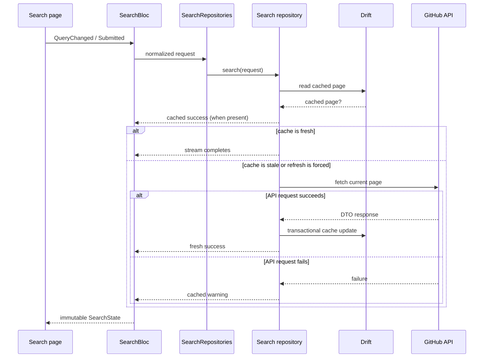

# Architecture

## Goals

Repo Scout is intentionally larger than a minimum two-screen demonstration. Its
architecture is designed to make network, persistence, state, and responsive UI
behavior independently replaceable and testable while keeping the application
domain free of framework details.

## Layer boundaries

| Layer | Owns | May depend on |
|---|---|---|
| `domain` | Entities, repository contracts, use cases | Dart and feature-neutral core values |
| `data` | GitHub DTOs, Drift schema, sources, mappers, implementations | Domain, core, Dio, Drift |
| `presentation` | BLoCs, pages, adaptive widgets | Domain, core, Flutter, BLoC |
| `app` | Routing, theme, shell, dependency composition | Every layer at the application edge |

The domain defines two small repository contracts:

- `RepositorySearchRepository` streams cache and network page results.
- `FavoriteRepositoriesRepository` watches and writes persistent favorites.

This separation applies Interface Segregation and keeps each use case dependent
only on the capability it needs.

## Search sequence

The repository returns a stream because a stale search operation can produce
two meaningful values: an immediate cached page and a later network page. A
fresh page completes after the cache value, avoiding an unnecessary GitHub
request. This keeps cache policy out of the BLoC without hiding intermediate
data behind callbacks.

## Search state

`SearchState` deliberately keeps orthogonal flags instead of collapsing every
combination into a large union. This is necessary because existing content may
remain visible while refresh or pagination is active.

| Field | Meaning |
|---|---|
| `status` | Initial, first-page loading, success, empty, or full failure |
| `repositories` | Deduplicated visible items |
| `currentPage`, `hasReachedEnd` | Pagination cursor and terminal state |
| `isRefreshing` | First page is being refreshed while content remains |
| `isLoadingNextPage` | A later page is loading |
| `isFromCache`, `isStale`, `fetchedAt` | Cache origin and age information |
| `failure` | Full-page failure with no usable content |
| `refreshFailure` | Background refresh warning with content preserved |
| `paginationFailure` | Inline next-page failure with retry |

Typing is debounced for 450 ms and processed with restartable concurrency.
Explicit submit and retry are immediate. A request identifier prevents late
stream values from a superseded query from updating the current screen. If an
explicit submit matches the normalized query and page already in flight, the
BLoC reuses that search instead of starting a duplicate request.

## Persistence schema

| Table | Purpose |
|---|---|
| `cached_repositories` | Canonical repository snapshot keyed by GitHub ID |
| `search_pages` | Query/page metadata, age, and next-page status |
| `search_page_items` | Ordered many-to-many relation between pages and repositories |
| `favorite_repositories` | Persistent favorite relation and creation time |

A repository can occur in many queries without duplicating its snapshot.
Writing a search page upserts repositories and replaces ordered relationships
inside one transaction. Favorites reference the same canonical rows and are
exposed as a Drift stream.

The schema begins at version 1. Future versions must include explicit migrations
and preservation tests. Foreign keys are enabled when the database opens.

## Failure model

Technical failures are translated at the data boundary into Freezed domain
failures: network, rate limit, server, cache, validation, and unexpected. UI
receives actionable messages without importing transport or persistence types.

Rate-limit responses are distinguished from general server errors. Cached data
continues to be emitted when a refresh fails. If neither source can satisfy a
request, the BLoC exposes a full error state with retry. A known future reset
time suppresses passive network requests until the limit should be available
again; explicit retry and pull-to-refresh bypass that guard.

## Dependency injection

`get_it` assembles the graph in `app/di/service_locator.dart`. It is a composition
tool, not an ambient service locator. The router resolves the `SearchBloc` factory
at the route-level `BlocProvider`; presentation widgets never access `get_it`
directly. Concrete classes use constructor injection, and tests instantiate
subjects directly. BLoCs are factories; the database and stateless sources,
repositories, and use cases are lazy singletons.

## SOLID mapping

- **SRP:** HTTP, cache queries, mapping, coordination, state, and rendering are
  separate responsibilities.
- **OCP:** A new remote source or cache strategy can implement the existing
  contracts without changing use cases or UI.
- **LSP:** Production repositories, fakes, and future cached implementations share
  result and failure semantics.
- **ISP:** Search and favorites use independent, capability-focused contracts.
- **DIP:** Use cases depend on domain contracts; outer data implementations depend
  inward on those contracts.

## Responsive design

The app has two behavioral layout modes. Below 840 logical pixels it uses
compact navigation and a single search field. At 840 and above, the shell changes
from bottom navigation to a rail and the search action moves beside the field.
Shared content-width widgets cap readable content on larger tablets instead of
introducing another navigation mode.

Responsive checks sample compact widths below 600, medium/tablet widths from 840,
and expanded widths from 1200. The latter two intentionally share behavior while
verifying that maximum-width constraints continue to hold on larger displays.

## Security and privacy

Only public GitHub data is requested. No token, account, analytics SDK, or user
identifier is stored. External links are restricted to parsed repository URLs
and opened outside the application.
